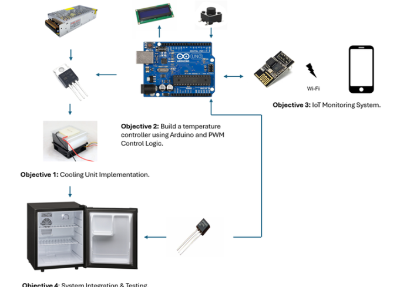
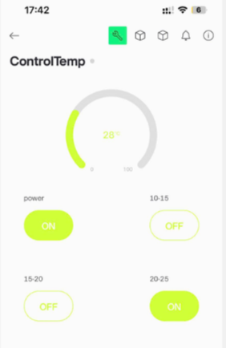
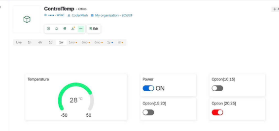
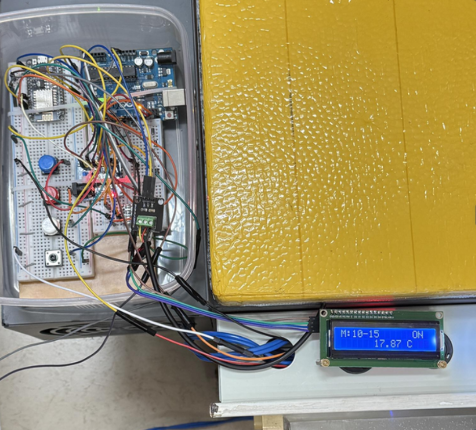
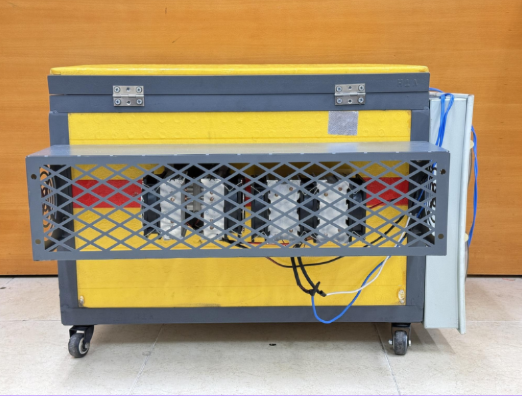

# IoT Peltier Refrigerator — Arduino + ESP8266

[](LICENSE)
[](https://github.com/dobuuphuoc/IoT-Peltier-Refrigerator-Arduino-ESP8266)
[](https://blynk.io/)

A comprehensive Capstone Design 2 project (September 2025 – January 2026) focusing on the research, design, and manufacturing of a **100-liter Peltier-based smart refrigerator**. Optimized for agricultural seed storage in Vietnam's hot, humid tropical climate, this system features an automated cooling control loop and real-time remote telemetry.

---

## 📌 Key Features

* **High Capacity Storage (100L):** Engineered with professional multi-layer insulation optimized for small-to-medium scale seed preservation.
* **Intelligent PWM Control:** An Arduino Uno executes an automated, threshold-based PWM control algorithm to adjust the Peltier module power via a high-current MOSFET driver based on user-defined setpoints.
* **Master/Slave I²C Architecture:** Employs a robust I²C communication link separating hardware-level real-time control (Arduino Uno) from internet-facing telemetry (ESP8266 NodeMCU).
* **Cloud IoT Synchronization:** Live sensor data streams seamlessly to the Blynk IoT Cloud via standard Wi-Fi (IEEE 802.11 b/g/n).
* **Dual-Platform Monitoring:** Real-time temperature logs, status alerts, and remote setpoint configurations accessible via both an interactive Web Dashboard and a dedicated Mobile App.

---

## 🛠️ Bill of Materials (BOM) & Hardware Architecture

The system is optimized for a cost-effective budget of approximately **1,096,000 VND**:

| Component | Specification & Functional Role |
| :--- | :--- |
| **Arduino Uno R3** | Master MCU; executes the real-time threshold-based PWM thermal control loop. |
| **ESP8266 NodeMCU** | Slave MCU; handles Wi-Fi connectivity and asynchronous cloud state synchronization. |
| **DS18B20 Sensor** | Waterproof, high-precision 1-Wire digital thermometer for cabinet core tracking. |
| **Peltier Module (TEC)**| Solid-state thermoelectric cooling unit driving the main refrigeration cycle. |
| **IRF540N MOSFET** | Heavy-duty N-channel power transistor utilizing logic-level PWM to drive the TEC. |
| **LCD 16x2 (I²C)** | Local alphanumeric display for instantaneous status, metrics, and error logging. |

---

## 📐 System Topology & Working Principle

The project architecture was meticulously broken down and integrated across four technical milestones:
1. **Objective 1:** High-efficiency thermoelectric cooling block configuration (Peltier, heat sinks, and thermal paste optimization).
2. **Objective 2:** Implementing an automated hardware driver circuit with dynamic PWM duty cycle regulation.
3. **Objective 3:** Building the Wi-Fi transmission layer and configuring the Blynk IoT cloud architecture.
4. **Objective 4:** Complete mechanical assembly inside an insulated chamber, system calibration, and environmental stress testing.



---

## 📱 Remote Dashboard & UI Configuration (Blynk IoT)

The user interface allows operators to toggle global system power and select specialized target ranges based on optimal agricultural preservation standards ($10-15^\circ\text{C}$, $15-20^\circ\text{C}$, $20-25^\circ\text{C}$).

### Mobile App & Web Dashboard Interface
<p align="center">
  
  
</p>

---

## 📸 System Implementation Gallery

<p align="center">
  
  
</p>

---

## 📂 Repository Structure

```text
📂 IoT-Peltier-Refrigerator-Arduino-ESP8266
├── 📂 image             # High-resolution block diagrams, UI designs, and physical project photos
├── 📂 source_code       # Embedded C++ firmware for both Arduino Uno and ESP8266 NodeMCU
├── 📄 report.pdf        # Complete academic capstone engineering thesis documentation
└── 📄 README.md         # Master repository guide and setup instructions
